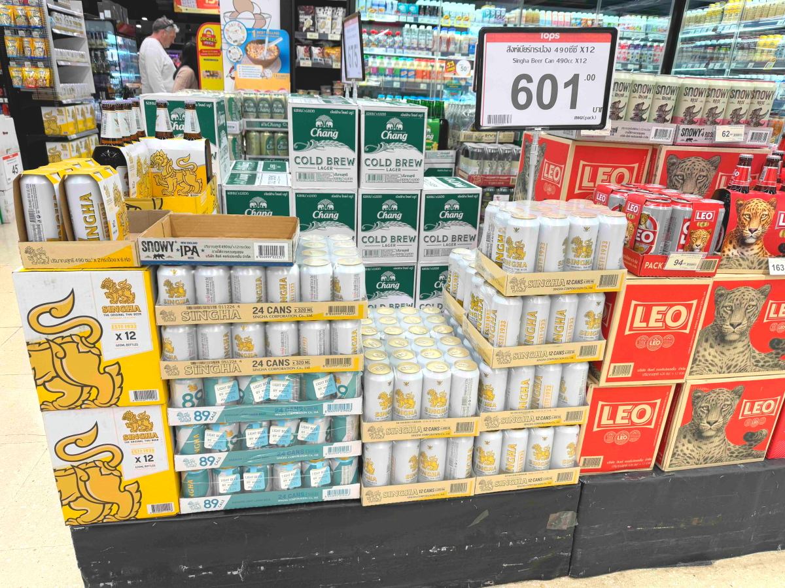
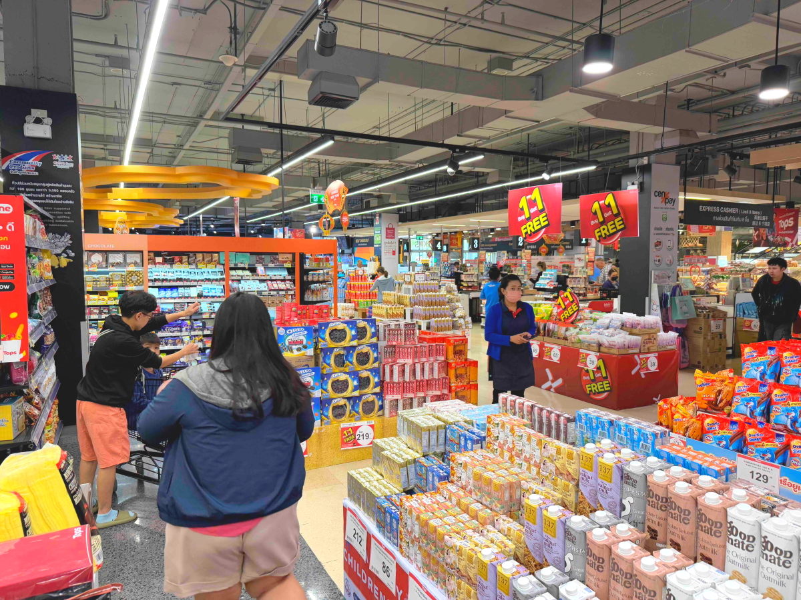
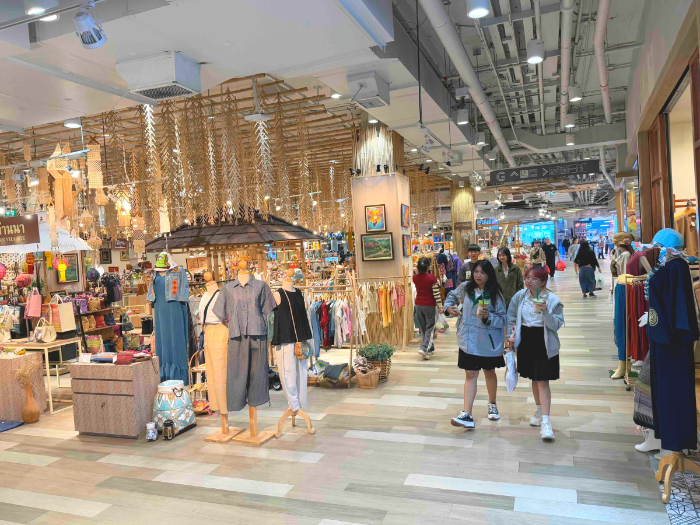
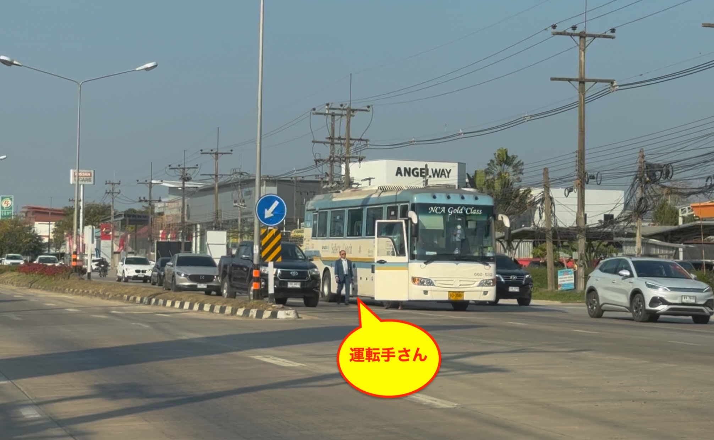

# 20250110_chiangrai

<html>
<head>

<meta charset="UTF-8">
<meta http-equiv="Content-Type" content="text/html; charset=UTF-8">
<meta http-equiv="X-UA-Compatible" content="IE=EmulateIE10" />
<meta http-equiv="X-UA-Compatible" content="IE=edge">

<!--ここから上はお決まりの定型文です-->

<!--ここからが表現の書式などを決めるcssという部分-->

<link href="https://cdnjs.cloudflare.com/ajax/libs/lightbox2/2.7.1/css/lightbox.css" rel="stylesheet">

</head>

<body>

モバイル端末をお使いの場合は、画面を横向きにすると
より見やすくご覧頂けます。

<!--ここ上は、ほぼそのまま使います！-->

<!--QRコードの挿入例-->

 アクセス用QRコード

<marquee direction="left" scrollamount="20" width="30%">(^_^)/~alis</marquee>

<!--流れ文字の挿入例-->
<h1><marquee behavior="left">!!! 2025/01/10 、チェンライ市内のショッピングモールを再度訪問 !!!</marquee></h1>

                          

<!--ここから下が、本体部分-->

<h2>9日に訪れた「CENTRAL」の銀行手続きに不備があったので、昨日に引き続き訪問 気になるイベントはもう終了、土日から始まる次のイベント準備中です</h2>

<h2>仏教系のオブジェもデパートでは可愛らしくデフォルメ</h2>

<h2>お昼ご飯はチャーハン、トッピングにタマゴや海老など入れて85バーツ(≒380円)</h2>

<h2>窓に面した席で外を眺めながらの昼食です</h2>

<h2>モールが広すぎて全部見切れていなかったスーパーを再調査</h2>

<h2>輸入品には産出国が表示されています</h2>

<h2>ゴッツ盛りは輸送量と関税が上乗せされて約660円に！</h2>

<h2>赤いきつねと緑のたぬきは約450円ですが、昨日買い占めてしまいました</h2>

<h2>韓国製もやや高め</h2>

<h2>ベトナム製は通常価格でした</h2>

<h2>国内製の食料品はスーパー的なお値段</h2>

<h2>蒸留酒系はグッと値段が上がります</h2>

<h2>冷凍食品を品定めする白人のお姉様</h2>

<h2>お刺身はかなり高め</h2>

<h2>ここからは現地産の新鮮な果物</h2>

<h2>バナナは短めのモチモチ系、日本には入っていないかも</h2>

<h2>スイカは縦長が主流でした</h2>

<h2>こちらのレジで会計、支払い</h2>

<h2>王室直営店もありました</h2>

<h2>野菜は無農薬栽培、ペットボトルの水はスーパーの半額です</h2>

<h2>左が前国王、右が第10代の現国王</h2>

<h2>軍敷地内の受刑者が作った作物を格安販売しています</h2>

<h2>どこに行っても学校帰りの女子高生が居るのは日本と同じ</h2>

<h2>片側３車線の国道でも、女性陣は普段着のままバイク乗車</h2>

<h2>二輪の生活への浸透度合いが、日本と全然違います</h2>

<h2>ノーヘルで80km/hクルーズするので、お化粧崩れが気になりますね</h2>

<h2>白人さんの自転車はバイクと同じ右折レーンで信号待ち</h2>

<h2>Accord HEV は初めて見ました</h2>

<h2>交差点の入り口で立ち往生してしまったバスがいました</h2>

<h2>国道に隣接しているお寺は、立派なものが多いです</h2>

<h2>こちらはハーレーのロゴを入れたソーダ水</h2>

<h2>製造はビールメーカー</h2>

<h2>午後にはお月様が昇ってきました</h2>

<h2>この日も綺麗な夕焼けグラデーションと宵の明星「金星」</h2>

   
<h2>以上、チェンライ「CENTRAL」と周辺の映像でした、ここまで観ていただきありがとうございました。</h2>

     
<h2>
<a href="https://torokoid.github.io/20241126_chiangrai/" target="_blank">Back to the menu page</a>
</h2>

   

         

  

      

<!--本体はここまで-->

<!--画面に空白地帯を作って、背景が見えるようにしています-->
                                              

<!-- フッタ -->
<footer>

Copyright 2025/01/11 alis @ChiangRai

</footer>

<!--HPにさまざまなJavaScriptを呼び込むための書式-->

